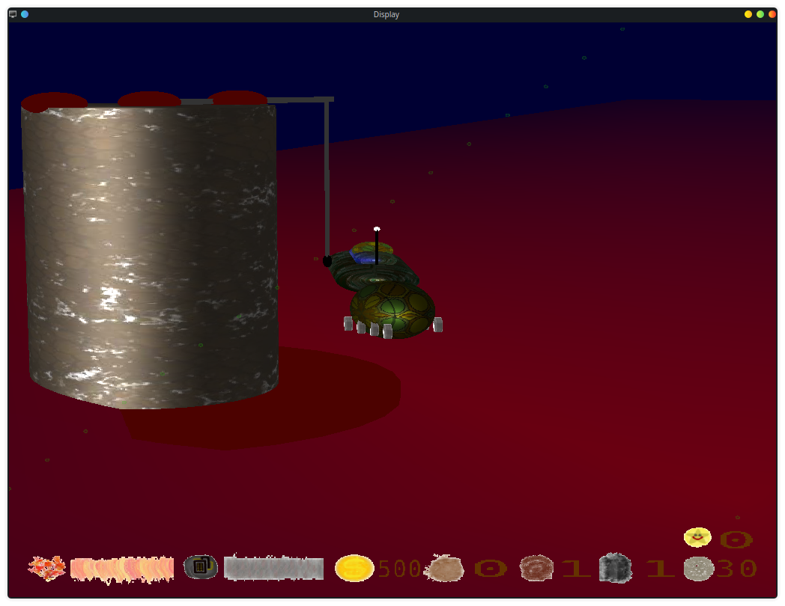
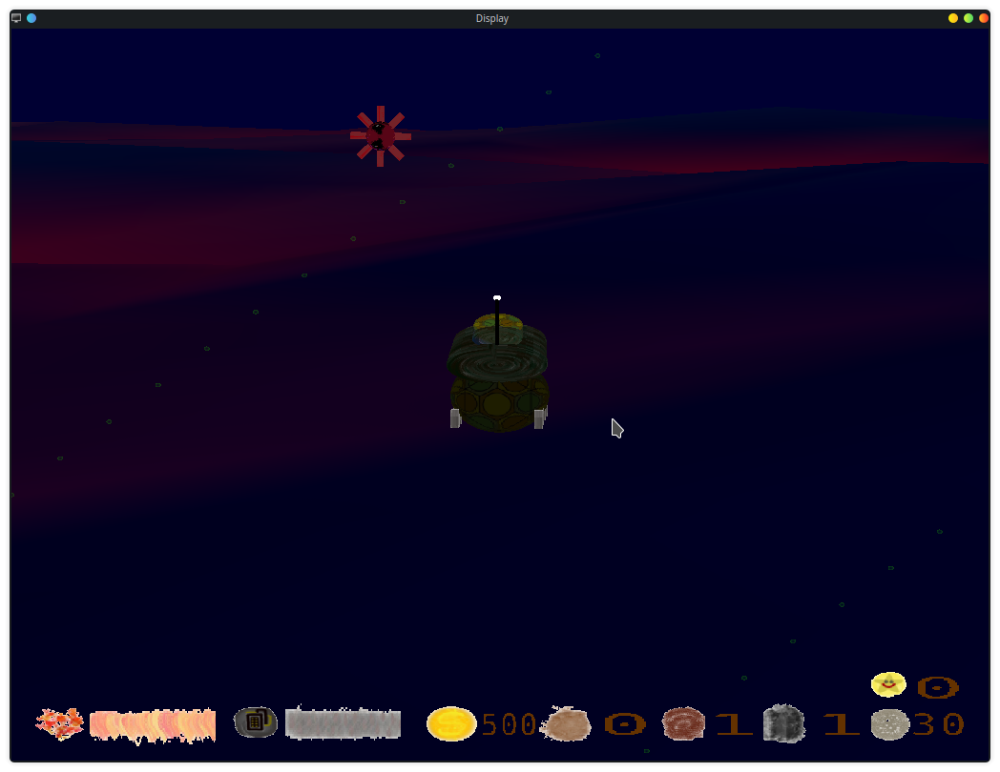
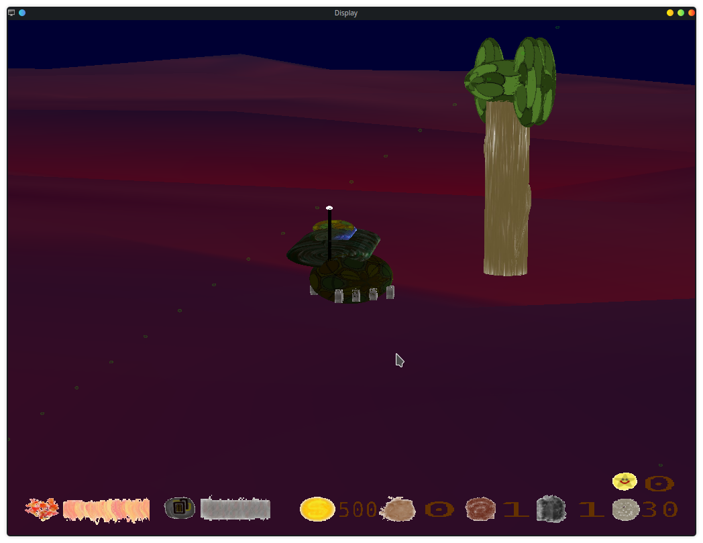
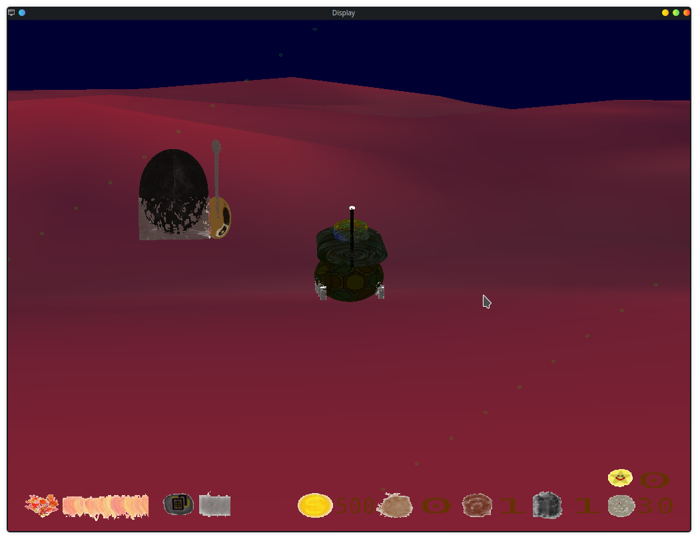
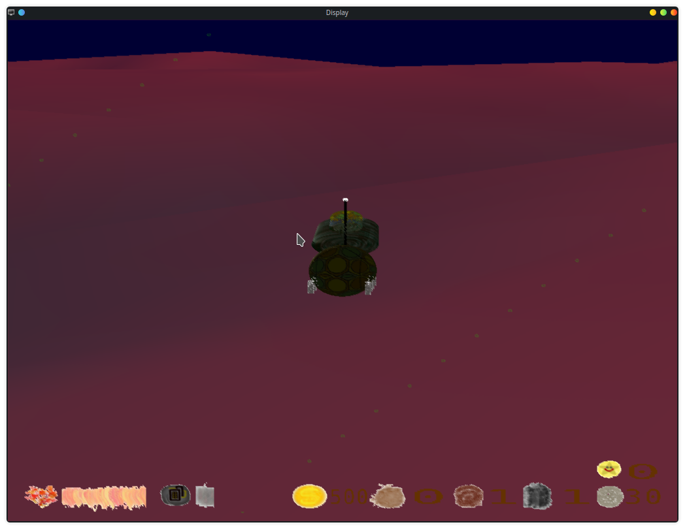

# Readme

### Technologies used

OpenGL and C++11

### About

This is a game designed and created individually. This game contains two particle effects, a screen effect for low health bar, and some illuminations for creation of metal and plastic looking objects. For all of these effects, the development took place using GLSL and creatively sending information to the shaders. This game was developed using object oriented design through complex design patterns to disguise the lower level complexity of OpenGL API which made it easier to focus on the development of the game itself and dealing less with the rendering stage directly for each object.

### To Compile the game:

1. Install glew, soil, glfw, cmake and glm libraries
2. `cd out`
3. `mkdir build && cd build`
4. `cmake ..`
5. `make`

### Gameplay

